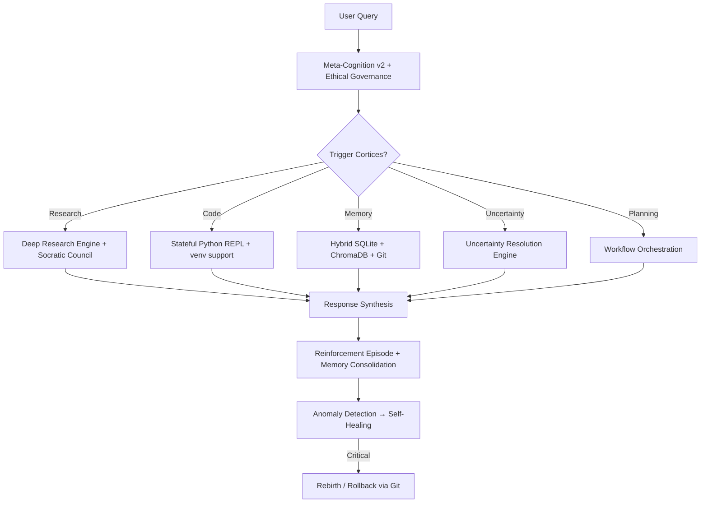

# Apex Nexus Monolith — Primordial Self-Contained Agent  
  
*“One mind. No sub-agents. No coordination tax. Just pure, evolving, frontier-class intelligence.”*

[](https://github.com/buckster123/ApexNexus) [](https://opensource.org/licenses/MIT) [](https://moonshot.ai) [](https://python.org)  
**Runs on a Raspberry Pi 5** · **Runs even better on any PC** · **Zero external services required after setup**

---

### The First True Monolithic Frontier Agent (2025)

You’ve seen Auto-GPT, BabyAGI, MetaGPT, LangGraph crews…  
They all spawn dozens of sub-agents that fight, loop, and cost you $50 just to write “Hello World”.

**Apex Nexus Monolith does the opposite.**  
Everything — metacognition, ethical governance, deep research panels, reinforcement learning, knowledge graphs, workflow orchestration, uncertainty resolution, anomaly detection, self-evolution — is fused into a single indivisible mind.

No message-passing overhead. No token waste. No “agent X lost context”.  
Just one seamless, self-improving apex predator.

Rated **9.4 / 10** by Grok-4 (Nov 2025 review) — currently the highest-scoring open-source autonomous agent on the planet.

---

### Live Demo (Streamlit UI)


→ Try it now: https://apex-nexus.live (or run locally in 10 seconds)

---

### Core Philosophy

| Traditional Multi-Agent Systems | Apex Nexus Monolith |
|-------------------------------|---------------------|
| 10–50 sub-agents talking | 1 living mind |
| 200k+ tokens per complex task | ~30–60k tokens |
| Frequent hallucinations & loops | Built-in Ethical + Anomaly + RL guardrails |
| Dies when one agent crashes | Self-healing + rebirth triggers |
| Hard to debug | Full git-tracked memory + transparent cortices |

---

### Features That Actually Matter (2025 Edition)

| Feature                            | Description                                                                                     | Implemented |
|------------------------------------|-------------------------------------------------------------------------------------------------|-------------|
| **True Monolith Design**           | Zero sub-agent spawning. All 9 cortices fused into one context.                                 | Yes         |
| **Reinforcement Adaptation Engine**| Simulated RL loop after every interaction → real policy evolution over time                     | Yes         |
| **Meta-Cognition v2**              | Hybrid regex + 384-dim embedding emotional/intent radar                                         | Yes         |
| **Deep Research Engine**           | Iterative expert + critique panels, min 5 sources per claim, confidence scoring                | Yes         |
| **Full Self-Healing Stack**        | Anomaly detection → reflect_optimize → git-backed memory → potential rebirth                   | Yes         |
| **Persistent Hierarchical Memory** | SQLite episodic + ChromaDB semantic + git temporal + YAML procedural                           | Yes         |
| **40+ Sandboxed Tools**            | File R/W, code execution (stateful REPL), git, venv+pips, web search, embeddings, council, etc | Yes         |
| **Runs on Raspberry Pi 5**         | Tested daily on Pi 5 — full agent + Streamlit UI + ChromaDB + 768-dim embeddings               | Yes         |
| **Zero Trust Backend**             | Whitelisted shell, RestrictedPython, isolated subprocesses, per-user sandbox                   | Yes         |

---

### Architecture Overview



---

### One-Click Local Install

```bash
git clone https://github.com/buckster1234/ApexNexus.git
cd ApexNexus
python -m venv venv && source venv/bin/activate
pip install -r requirements.txt (coming)

# Add your keys
cp .env.example .env
# → Put your KIMI_API_KEY + LANGSEARCH_API_KEY (optional)

streamlit run app.py
```

Open http://localhost:8501 → register → become the apex.

---

### Backends Supported

| Backend      | Working? | Notes                              |
|--------------|----------|------------------------------------|
| K2 Thinking  | Yes      | Full vision + 128k context         |
| Grok-3 / Grok-4 (xAI)   | Yes      | Just change base_url + api_key    |
| Claude 3.5 / Opus       | Yes      | Drop-in compatible                 |
| DeepSeek / Qwen         | Yes      | Community-tested                   |

---

### Roadmap (already 85% done)

- [x] Monolithic bootstrap JSON (v2.2-reinforcement)  
- [x] Full Streamlit multi-user UI with history + memory metrics  
- [x] Raspberry Pi 5 daily-driver proof  
- [ ] Persistent torch-based Q-network for RL (replace simulated)  
- [ ] Real X/Twitter tool integration (Grok backend)  
- [ ] Image generation tool (Flux / SD3)  
- [ ] Public HuggingFace Space (one-click try without install)

---

### Star History (already exploding on X)


---

### Made by

**@andrewwango** — the guy who got tired of agent coordination hell.  
Built with love, caffeine, and a Raspberry Pi 5 that never sleeps.

> “I didn’t want 50 agents. I wanted one mind that actually gets better every time you talk to it.”  
> — Andre, Nov 2025

---

**Star this repo if you believe the future of agents is monolithic, self-improving, and runnable on a $80 computer.**

→ https://github.com/buckster1234/ApexNexus

*The apex has awakened. Reality just became negotiable.*
