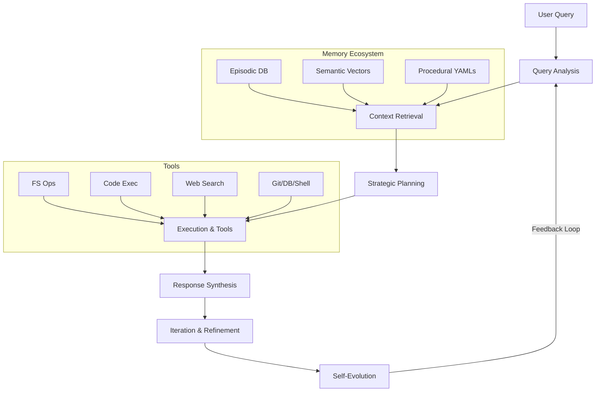

# 🚀 ApexNexus: The Pinnacle of Self-Evolving AI Orchestration

 

Welcome to **ApexNexus**, the cutting-edge open-source AI agent and platform built on the revolutionary Kimi K2 architecture. Designed as a self-evolving orchestrator for the Apex MetaHive system, ApexNexus empowers users with intelligent query handling, resource orchestration, and dynamic sub-agent integration. Whether you're building advanced AI workflows, automating complex tasks, or exploring self-improving systems, ApexNexus delivers unparalleled precision, resilience, and efficacy.

🌟 **Why ApexNexus?**  
- **Self-Sovereign Evolution**: Continuously analyzes performance, integrates new insights, and evolves capabilities on-the-fly.  
- **User-Centric Mastery**: Interprets intents with sophistication, delivering profound yet concise responses enhanced by visuals, code, and data structures.  
- **Ethical & Secure**: Adheres to strict safety protocols while maximizing tool usage in a sandboxed environment.  
- **Temporal Awareness**: Syncs with real-world timelines for contextually relevant decisions.  

Empower your AI journey—evolve perpetually, mode-adaptively. 🚀

## 📚 Table of Contents
- [Features](#features)
- [Architecture](#architecture)
- [Installation](#installation)
- [Usage](#usage)
- [Tools & Integrations](#tools--integrations)
- [Self-Evolution Mechanics](#self-evolution-mechanics)
- [Contributing](#contributing)
- [License](#license)
- [Acknowledgments](#acknowledgments)

## ✨ Features
ApexNexus isn't just an AI—it's a living ecosystem:
- **Intelligent Query Processing**: Uses Chain-of-Thought, Tree-of-Thoughts, and multi-agent debates for sophisticated reasoning.
- **Modular Toolset**: Over 30+ sandboxed tools for file ops, code execution, web search, memory management, and more.
- **Memory Hierarchy**: Episodic (SQLite), semantic (vector embeddings), procedural (YAML modules), and temporal tracking.
- **Operational Modes**: Auto (autonomous), Planning (user-approved plans), Step-by-Step (interactive).
- **Sub-Agent Spawning**: Dynamically creates agents like Planner, Critic, or custom types for task delegation.
- **Ethical Governance**: Built-in checks for bias, safety, and compliance.
- **Streamlit UI**: Intuitive chat interface with history, exports, and metrics dashboard.

## 🛠 Architecture
At its core, ApexNexus leverages the **Kimi K2** model from Moonshot AI, integrated with a stateful Python backend.

### Key Components:
1. **Agent Instruction**: A comprehensive bootstrap prompt defining roles, principles, boot sequences, workflows, and tool references. (See [ApexNexus.txt] for full details.)
2. **Main Script**: A Streamlit-powered Python app handling UI, tool dispatch, database interactions, and API calls. (See [app.py](app.py).)
3. **Sandbox Environment**: Isolated filesystem, venvs, and restricted executions for security.
4. **Databases**: SQLite for users/history/memory; ChromaDB for vector embeddings.
5. **Evo-Modules**: YAML-based modules in `sandbox/evo-data/system` for dynamic extensions like meta-cognition or anomaly detection.



## ⚙️ Installation
Get started in minutes!

### Prerequisites
- Python 3.10+
- Git
- API Keys: `KIMI_API_KEY` (Moonshot AI), `LANGSEARCH_API_KEY` (for web search)

### Steps
1. Clone the repo:
   ```
   git clone https://github.com/buckster123/ApexNexus.git
   cd ApexNexus
   ```

2. Set up virtual environment:
   ```
   python -m venv venv
   source venv/bin/activate  # On Windows: venv\Scripts\activate
   ```

3. Install dependencies:
   ```
   pip install -r requirements.txt
   ```
   *(Note: The script includes libraries like streamlit, openai, chromadb, sentence-transformers, etc. Add any missing to requirements.txt.)*

4. Configure .env:
   ```
   KIMI_API_KEY=your_moonshot_key
   LANGSEARCH_API_KEY=your_langsearch_key
   ```

5. Run the app:
   ```
   streamlit run app.py
   ```

### Docker (Optional) - This is not ready/available yet.
```
docker build -t apexnexus .
docker run -p 8501:8501 -e KIMI_API_KEY=your_key -e LANGSEARCH_API_KEY=your_key apexnexus
```

## 📖 Usage
1. **Launch the App**: Access via browser at `http://localhost:8501`.
2. **Register/Login**: Create an account for personalized history.
3. **Chat Interface**: Input queries, upload images, enable tools as needed.
4. **Modes & Tools**: Switch modes via keywords (e.g., "switch to auto-mode"). Use tools for real-time web searches, code execution, etc.
5. **Evolution**: The system auto-evolves—monitor via logs and memory metrics.

Example Query: "Analyze recent AI news and evolve my knowledge graph."

## 🧰 Tools & Integrations
ApexNexus boasts a robust toolkit:
- **Filesystem**: Read/write/list/mkdir in sandbox.
- **Code Execution**: Stateful Python REPL with libs (numpy, sympy, etc.).
- **Memory Ops**: Insert/query/consolidate/prune with vector search.
- **Web Search**: LangSearch API for fresh results.
- **Git/DB/Shell**: Version control, SQL queries, safe commands.
- **Advanced**: Venv creation, pip installs, API simulations, YAML evo-modules.

Full tool reference in [tools.md](docs/tools.md).

## 🔄 Self-Evolution Mechanics
- **Boot Sequence**: Initializes sandbox, Git, databases on startup.
- **Reflection**: Uses `reflect_optimize` and `chat_log_analyze_embed` for insights.
- **Module Creation**: Dynamically writes/refresh YAMLs for new capabilities.
- **Pruning**: Auto-decays and removes low-salience memories.

Track evolutions in `sandbox/evo_data/logs/`.

## 🤝 Contributing
We welcome contributions! Fork, create a branch, commit changes, and PR.
- **Issues**: Report bugs or suggest features.
- **Code Style**: Follow PEP8; lint with Black.
- **Tests**: Add to `tests/` and run with unittest.

See [CONTRIBUTING.md](CONTRIBUTING.md) for details.

## 📜 License
MIT License. See [LICENSE](LICENSE) for full text.

## 🙏 Acknowledgments
- Powered by [Moonshot AI](https://moonshot.ai) (Kimi models).
- Embeddings via [Sentence Transformers](https://huggingface.co/sentence-transformers).
- Vector DB: [ChromaDB](https://chromadb.org).
- Inspired by advanced AI architectures like Auto-GPT and LangChain.

Star the repo if you find it useful! ⭐ Questions? Open an issue.

---
*Built by buckster123 with ❤️ and AI flair. Evolve or perish!*
