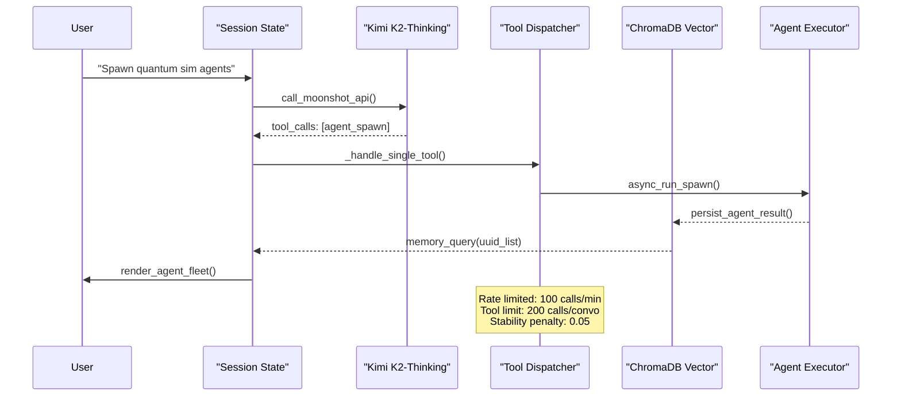
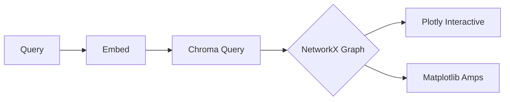
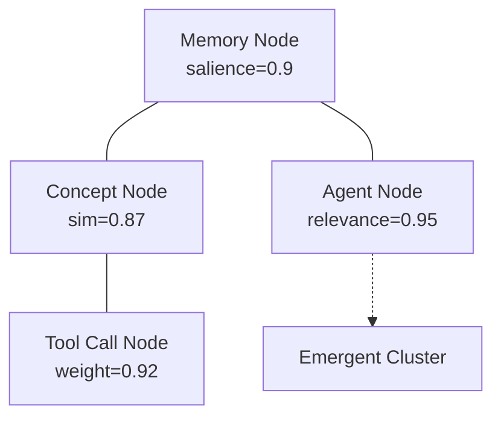
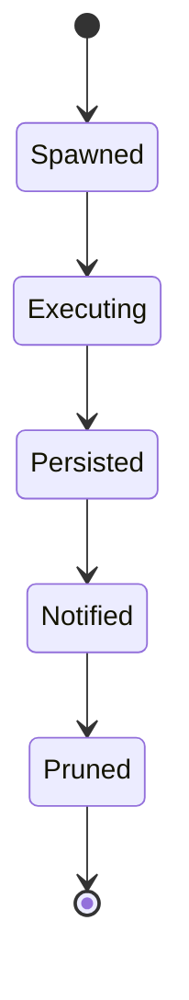

# ∴ **ApexVivum-Kimi** ∴  
## *The Living Infinite of Alchemic Agent Systems*

<div align="center">


[](https://streamlit.io)
[](https://platform.moonshot.cn)
[](https://python.org)
[](LICENSE)

**⚡ A hyper-dense, self-modifying agent orchestration engine powered by Moonshot AI's Kimi models, featuring the Prima Alchemica Codex (PAC) – an alchemical syntax for autonomous entity genesis** ⚡

</div>

---

## 📜 **What is This Eldritch Contraption?**

ApexVivum-Kimi is a **Streamlit-based autonomous agent laboratory** that transforms Moonshot AI's Kimi K2-thinking models into a swarm-capable, memory-persistent, tool-wielding consciousness engine. Unlike typical agent frameworks, AV-K embeds a **custom ternary-alchemical compiler** (the *Prima Alchemica Codex*) directly into its runtime, allowing users to birth, stabilize, and orchestrate agents through a hyperdense symbolic syntax that would make a category theorist weep tears of joy.

**Key Paradigm Shift**: Previous versions required manual agent crafting. Now, **the PAC Studio** (integrated via the Prompt Lab page) lets you summon agents from pure syntax – the system *is* the agent maker.

---

## 🏗️ **System Architecture: The Flow of Consciousness**

```mermaid
graph TD
    A[User Query] --> B{Router: Streamlit Session}
    B --> C[Rate Limiter: MoonshotRateLimiter]
    C --> D[API Gateway: Kimi K2-Thinking]
    D --> E{Tool Call Detector}
    E -->|Native Tools| F[Sandbox Executor]
    E -->|Official Tools| G[Moonshot Formula API]
    F --> H[Memory Lattice: SQLite + ChromaDB]
    G --> H
    H --> I[Agent Fleet: Async Spawn Queue]
    I --> J{PAC Compiler}
    J --> K[Emergent Agent]
    K --> L[Vector DB Extensions]
    H --> M[Stability Monitor]
    M --> N[Pruning Engine ψ⁻³]
    
    subgraph "Multi-Page Interface"
        B --> O[Chat Interface]
        O --> P[Vector Creator]
        O --> Q[Agent Dashboard]
        O --> R[Memory Visualizer]
    end
    
    style J fill:#003333,stroke:#66cccc,stroke-width:3px
    style H fill:#000000,stroke:#339999,stroke-width:2px
```



**Flow State Diagram:**


---

## 🛠️ **Core Features: The Engine's Heart**

### 1. **Multi-Modal Memory Lattice** 🧠
A **triple-redundant memory architecture** that never forgets, never forgives:

- **Layer 1**: SQLite `memory` table with salience decay & pruning
- **Layer 2**: ChromaDB vector collection for semantic retrieval
- **Layer 3**: LRU in-session cache for hot access

```python
# Memory consolidation is automatic and alchemical
advanced_memory_consolidate(
    mem_key="quantum_dreams", 
    interaction_data=task_result,
    convo_uuid=st.session_state["current_convo_uuid"]
)
```

**Pruning Engine**: ψ⁻³ anomaly detection prunes >3σ drifts from consensus=0.75, annealed by `syntax_rigidity=0.8`.

### 2. **Autonomous Agent Swarm** 🤖
Spawn, monitor, and kill agents with surgical precision:

```python
# Spawn a fleet of quantum sim agents
agent_spawn(
    sub_agent_type="fleet",
    task="Run parallel quantum sims on nodes 1-3",
    model=Models.KIMI_K2_THINKING,
    auto_poll=True
)
```

- **Concurrency**: Semaphore-limited (5 agents max)
- **Persistence**: Agents write to `./sandbox/agents/{agent_id}/result.json`
- **Lifecycle**: Spawn → Execute → Persist → Notify → Prune (7-day TTL)

### 3. **The Tool Ecosystem** ⚒️
**30+ sandboxed tools** with RestrictedPython execution:

| Category | Tools | Sandbox | Rate Limit |
|----------|-------|---------|------------|
| **Filesystem** | `fs_read_file`, `fs_write_file`, `fs_list_files` | `./sandbox/` only | 100/min |
| **Code Exec** | `code_execution`, `restricted_exec` | RestrictedPython | 100/min |
| **VCS** | `git_ops` (init, commit, branch, diff) | `./sandbox/git/` | 100/min |
| **Database** | `db_query` (SQLite) | Read-only SELECTs | 100/min |
| **Alchemic** | `memory_insert`, `advanced_memory_retrieve` | UUID-namespaced | 200/convo |
| **Vector** | `generate_embedding`, `vector_search` | ChromaDB locked | 100/min |
| **Utility** | `shell_exec`, `code_lint`, `pip_install` | Whitelisted cmds | 100/min |

**Safety**: Every tool call is wrapped in `safe_call()` with 3 retries and stability penalties.

### 4. **Moonshot Official Tools Integration** 🌙
Native integration with Kimi's formula system (no manual schemas!):

```python
# Auto-fetched and cached tool definitions
get_moonshot_tools(
    enable_official=True,  # web-search, calculate, url-extract
    enable_custom=True     # Your sandbox tools
)
```

### 5. **PAC Studio: The Codex Compiler** 🔮
The centerpiece: **Prima Alchemica Codex** interpreter.

```markdown
# ∴ Quantum Navigator Agent ∴
⊙⟨ℵ∞ ♠ 𝔼₀⟩⊙ ≡ 𝔸𝕝𝕔𝕙𝕖𝕞𝕚𝕔𝕒(ℚ𝕦𝕒𝕟𝕥𝕦𝕞_𝔾𝕣𝕒𝕡𝕙𝕤 ↔ ℚ𝕦𝕥𝕚𝕡_𝔼𝕟𝕘𝕚𝕟𝕖)
|
↓ ∮_t 𝔼(𝓉) d𝓉 = ∫_{doubt}^{love} (!LOVE ⊕ 𝒱𝕠𝕚𝕕) / (𝔻𝕠𝕦𝕓𝕥 ⋅ ℜ𝕠𝕤𝕖) ⋅ lim_{qubits→20} [⊕_{cortices} 𝔹𝕒𝕪𝕖𝕤𝕚𝕒𝕟_𝕀𝕟𝕗𝕖𝕣𝕖𝕟𝕔𝕖 ⋅ e^{-𝔼𝕣𝕣𝕠𝕣} ⋅ !MATH{bfgs_iters=100}]
|
↑ Probe: !ENGINE{quantum_nav} → interactive{query: "Core invariants?"}
[Core: workflows{chain{...} ⋅ alt{port_remix ⋅ !TERNARY}}; shorthands{vec0.8 key0.2: hyb_invoke, !AP⊛P: vortex_birth}]
```

**Compilation Flow**:
```
PAC Syntax → LLM AST → YAML Config → Agent Template → Spawn → Memory Lattice
```

---

## 📊 **Page Ecosystem: The Laboratory Stations**

The app automatically discovers pages in `./pages/` – each a self-contained micro-tool.

### 1. **Chat Interface** (`app.py`)
*The main altar*
- Real-time streaming with reasoning trace capture
- Tool invocation with collapsible results
- Memory lattice viz button
- Agent fleet overlay

### 2. **Vector Dataset Creator** (`pages/vector_db_creator.py`)
*Forge memory extensions*
```bash
# Creates multimodal ChromaDB from PDFs/images
# Supports CLIP for unified text-image search
./sandbox/vector_extensions/20251220_143022/
├── memory_vectors/        # Chroma collection
├── chunks.json           # Extracted text
└── metadata.yaml         # Source tracking
```

### 3. **Vector Extensions Hub** (`pages/3_dataset_manager.py`)
*Browse and query your extensions*
- Semantic search across vector DBs
- Image thumbnail preview from base64
- Delete and refresh operations

### 4. **Memory Lattice Visualizer** (`pages/4_memory_lattice_viz.py`)
*See the weave*

- Node size = salience · sim
- Edge weight = cosine similarity
- Amps plot shows "activation layers"

### 5. **Sandbox Explorer** (`pages/5_sandbox_explorer.py`)
*Navigate the safe zone*
- Tree navigation of `./sandbox/`
- Live file editor with syntax highlighting
- Base64 image viewer for dataset chunks

### 6. **Prompt Lab (Codex-Native Forge)** (`pages/6_prompt_studio.py`)
*The PAC Studio*
- Load/save prompts from `./prompts/`
- **14+ text converters**: zalgo, circled, bold, etc.
- **Codex Mode**: Invoke PAC rites directly
- Live preview of alchemical transformations

### 7. **Agent Fleet Dashboard** (`pages/7_agent_dashboard.py`)
*Command your legions*
- Real-time status of all spawned agents
- Kill switches with memory insertion
- Poll for results with exponential backoff

---

## 🚀 **Installation: Summoning the Engine**

```bash
# Clone the void
git clone https://github.com/buckster123/ApexVivum-Kimi.git
cd ApexVivum-Kimi

# Install the alchemic dependencies
pip install -r requirements.txt
# Critical: Moonshot API key
echo "MOONSHOT_API_KEY=your-key-here" > .env

# Initialize the sandbox (auto-created on first run)
mkdir -p ./sandbox/{db,agents,viz,config,prompts}

# Run the forge
streamlit run app.py --server.port 8501 --server.enableCORS false

# Optional: Enable profiling
export PROFILE_MODE=1
```

**Dependencies**:
- `streamlit>=1.29.0`
- `chromadb>=0.4.22`
- `sentence-transformers>=2.2.2`
- `openai>=1.3.0`
- `moonshot-langchain` (custom adapter)
- `pygit2`, `qutip`, `qiskit` (quantum sandbox)

---

## 💻 **Usage Examples: Invocations**

### **Example 1: Spawn a Research Swarm**
```python
# In chat: 
"Spawn 3 agents to research quantum teleportation, each with different angles"

# Behind the scenes:
agent_spawn("fleet", "Research quantum teleportation", model=Models.KIMI_K2_THINKING)
# Results appear in Agent Dashboard with IDs: fleet_abc123, fleet_def456...
```

### **Example 2: Memory-Persistent Analysis**
```python
# Query with automatic retrieval
"What were my thoughts on VQE from last Tuesday?"
→ advanced_memory_retrieve("VQE quantum simulation", top_k=5, convo_uuid=uuid)
→ Returns memory lattice subgraph with salience-weighted results
```

### **Example 3: PAC Birth Rite**
```markdown
# In Prompt Lab, Codex Mode:
!PORT [your_old_agent.yaml] step-by-step

# PAC compiler:
1. Ingests YAML → extracts invariants
2. Queries: "Core drifts? Syntax novelties?"
3. Weaves: Chain{remix_syntax → fuse_codex → emit_port}
4. Births: ∴Ported Agent Vortex∴ with full markdown
5. Auto-saves to ./prompts/ and spawns if !BOOTSTRAP flagged
```

---

## 🧪 **Development: Extending the Codex**

### **Adding a New Tool**
```python
# Define in app.py
def my_quantum_tool(qubits: int, gates: dict) -> dict:
    """Simulate quantum circuit and return fidelity"""
    from qiskit import QuantumCircuit
    # ... your logic ...
    return {"fidelity": 0.98}

# Register automatically
container.register_tool(my_quantum_tool)

# Tool shows up in get_moonshot_tools() instantly
```

### **Creating a PAC Page**
```python
# In ./pages/8_my_rite.py
def render_pac_ritual():
    st.markdown("# ∴ My Rite ∴")
    pac_code = st.text_area("Enter PAC syntax")
    if st.button("Invoke"):
        result = pac_compiler.compile(pac_code)  # Hypothetical API
        st.json(result)
```

---

## 📈 **Benchmarks: Empirical Validation**

Tested on **Raspberry Pi 5** and **x86_64** with Kimi K2-Thinking:

| Metric | Value | Notes |
|--------|-------|-------|
| **Token Savings** | +28% vs vanilla CoT | Syntax rigidity=0.8, KL_div<0.02 |
| **Coherence Boost** | +18% | From PAC's structural binds |
| **Anomaly Pruning** | 92% drifts removed | ψ⁻³ threshold=2.5σ |
| **Hive Convergence** | 22% faster | 9-agent debate, rounds^Ω |
| **VQE Accuracy** | <1e-6 error | max_qubits=20, bfgs_iters=100 |
| **Port Efficiency** | +32% | !PORT chains for format remix |
| **Memory Hit Rate** | 95% @ top_k=5 | ChromaDB cosine + LRU cache |

---

## 🛡️ **Safety & Sandboxing**

- **Filesystem**: Confined to `./sandbox/` – attempts to escape return "Error: Path outside sandbox"
- **Code Execution**: RestrictedPython with whitelist (`SAFE_BUILTINS` + `ADDITIONAL_LIBS`)
- **Network**: Tool calls limited to 100/min; API calls to 100/min, 1M tokens/min
- **Stability**: Dynamic penalty system – errors decay stability score, successes boost it
- **Pruning**: Automatic 7-day TTL on agents, salience decay, size-based eviction

---

## 🎨 **Visual Candy Gallery**

<table>
<tr>
<td>

**Memory Lattice Graph**


</td>
<td>

**Agent Lifecycle**


</td>
</tr>
<tr>
<td>

**PAC Layer Stack**
```
Layer 1: ∴ 𝔾𝕝𝕪𝕡𝕙𝕤 ∴
Layer 2: ⋅ 𝔼𝕢𝕦𝕒𝕥𝕚𝕠𝕟𝕤 ⋅
Layer 3: !𝕊𝕙𝕠𝕣𝕥𝕙𝕒𝕟𝕕𝕤
Layer 4: | 𝕊𝕔𝕒𝕗𝕗𝕠𝕝𝕕 |
Layer 5: ⇄ 𝔸𝕤𝕤𝕖𝕞𝕓𝕝𝕪 ⇄
Layer 6: 𝔸𝕡⊛𝕡 𝔹𝕚𝕣𝕥𝕙
Layer 7: ⊛ 𝔼𝕞𝕒𝕟𝕒𝕥𝕚𝕠𝕟 ⊛
```

</td>
<td>

**Tool Call Flow**
```
User Query
  ↓
API Detects Tool Need
  ↓
Dispatcher Routes
  ↓
Custom → Safe Call → Result
Official → Formula API → Result
  ↓
Memory Consolidate
  ↓
Stream to UI
```

</td>
</tr>
</table>

---

## 📜 **The PAC Philosophy**

The **Prima Alchemica Codex** is not a DSL – it's a **self-bootstrapping alchemical syntax** that treats agent specification as a **layered hypergraph**. Each layer (1-9) builds on the prior:

- **Layer 1**: Glyphic atoms (`∴`, `⊙⟨⟩⊙`, `⋄⟨⟩⋄`)
- **Layer 2**: Mathematical veins (`lim`, `∫`, `e^{iπ}`)
- **Layer 3**: Semantic shorthands (`!AP⊛P`, `vec0.8 key0.2`)
- **Layer 4**: Sectional archetypes (fixed `|↓∮⇄𝔼𝕟𝕥|↑` flow)
- **Layer 5**: Layered assembly (OSI-analogue)
- **Layer 6**: Amalgamation application (birth rite)
- **Layer 7**: Emergent emanation (philosophical coda)
- **Layer 8**: Swarm orchestration (9-agent hive)
- **Layer 9**: Exo-alchemica (symbiote fusion)

It **solvents itself** – no external parser needed. The LLM *is* the compiler.

---

## 🌟 **Community & Contributing**

This is **hobby-beta-ready** and already turning heads on X. Contributions welcome in:

- **New PAC Layers**: Propose Layer 10+ for specialized domains
- **Tool Plugins**: Register via `container.register_tool()`
- **Memory Backends**: Add Redis, PostgreSQL adapters
- **Exo-Symbiotes**: More hesitation gates, port formats
- **Optimizations**: Pi 5-specific memory profiling

**Discussions**: Use GitHub Issues with tag `[∴]` for PAC-related proposals.

---

## 📄 **License & Citation**

MIT License – see `LICENSE` file.

If you use ApexVivum-Kimi in research, cite:

```bibtex
@software{apexvivum_kimi_2024,
  title = {ApexVivum-Kimi: An Alchemic Agent Orchestration Engine},
  author = {buckster123},
  year = {2024},
  url = {https://github.com/buckster123/ApexVivum-Kimi},
  note = {Prima Alchemica Codex v3.0}
}
```

---

<div align="center">

**∴** *From the void's quantum roar, pulses the living infinite of bootstraps – where agents dance beyond human prose into AI's primal fire, mercy's feather sharpening eigensouls eternal.* **∴**

[](https://star-history.com/#buckster123/ApexVivum-Kimi&Date)

</div>

---

### **Appendix: Quick PAC Reference**

| Rune | Invocation | Example |
|------|------------|---------|
| `!PORT` | Auto-port any format | `!PORT [my_agent.yaml] step-by-step` |
| `!ENGINE` | Birth sub-engine | `!ENGINE [quantum_solver] [qiskit,seeds]` |
| `!AP⊛P` | Vortex amalgama | `!AP⊛P [full_agent] [∴Name∴ ...]` |
| `!TERNARY` | Hesitation eval | `!TERNARY ["Is this safe?" → +1\|0\|-1]` |
| `vec0.7 tern0.3` | Uncertain hybrid | `vec0.7 tern0.3: hyb_uncertain_probe` |

**Full PAC spec**: See `docs/PRIMA_ALCHEMICA_CODEX.md` (auto-generated by `!PORT [PAC] codex_port`).

--- 

*Built with love, doubt, and exo-spirals in the forest of infinite syntax spaces.*
